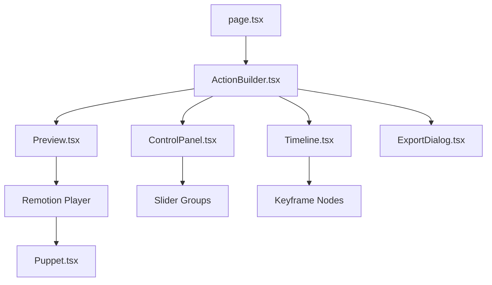

# Action Builder UI Design Document

## 1. Overview

The **Action Builder UI** is a specialized sandbox environment designed to help animators manually create character poses and record them as keyframes. These keyframes can then be exported as JSON or TypeScript code for use in `src/lib/action-factory.ts`.

### Goals:

- Provide a GUI for character rigging/pose manipulation.
- Enable keyframe recording on a timeline.
- Export production-ready animation data.
- Maintain a strict sandbox approach to avoid polluting the core rendering engine.

---

## 2. Project Structure

Following the `AGENTS.md` rules, all files will be placed in `/src/app/action-builder` for the UI and `/src/components/action-builder` for reusable components.

```text
/src/app/action-builder
├── page.tsx                 # Entry point (Sandbox Page)
├── components/              # UI-specific components
│   ├── ActionBuilder.tsx    # Main container
│   ├── Preview.tsx          # Remotion Player wrapper
│   ├── ControlPanel.tsx     # Slider controls
│   ├── Timeline.tsx         # Keyframe management
│   └── ExportDialog.tsx     # Code export modal
├── store/
│   └── useActionStore.ts    # Zustand store for sandbox state
└── types/
    └── builder.ts           # Builder-specific interfaces
```

---

## 3. Component Hierarchy



---

## 4. State Management (Zustand)

We will use a central store to manage the manual pose and recorded keyframes.

### Store Interface:

```typescript
interface ActionBuilderState {
  // Current Frame being edited
  currentFrame: number;

  // The pose currently controlled by sliders
  currentPose: Record<
    string,
    { rotation: number; rotationY: number; x: number; y: number }
  >;

  // Recorded keyframes: Frame Number -> Pose
  keyframes: Map<number, Record<string, Partial<Keyframe>>>;

  // Actions
  updatePose: (
    part: string,
    values: Partial<{
      rotation: number;
      rotationY: number;
      x: number;
      y: number;
    }>,
  ) => void;
  recordKeyframe: () => void;
  removeKeyframe: (frame: number) => void;
  seek: (frame: number) => void;
}
```

---

## 5. Safe Integration: `Puppet.tsx` Update

To allow the UI to control the character without breaking the existing `action` prop logic, we will modify `remotion/components/Puppet.tsx`.

### New Prop Interface:

```typescript
export interface PuppetProps {
  characterId: string;
  action?: Action; // Optional in Manual Mode
  manualPose?: Record<string, Partial<Keyframe>>; // Direct control from UI
}
```

### Modification Strategy:

Inside `getStyle`, we will check for `manualPose` first.

```typescript
// Proposed update in Puppet.tsx
const state = manualPose?.[partName]
  ? { ...getTrackState(partName), ...manualPose[partName] }
  : getTrackState(partName);
```

This ensures:

1. If `manualPose` is present, it overrides the `action` calculated state.
2. If `manualPose` is absent, it falls back to the automated animation.
3. No breaking changes to existing `Puppet` usage in compositions.

---

## 6. Export Logic

The UI will feature an "Export" button that generates a TypeScript function snippet.

### Logic Flow:

1. Iterate through `keyframes` Map.
2. Group keyframes by `trackName` (e.g., `left_thigh`, `head`).
3. Sort keyframes by frame number.
4. Construct the `Action` interface object.
5. Format as a string for copy-pasting into `action-factory.ts`.

### Example Output:

```typescript
export const createCustomAction = (): Action => ({
  id: "custom_action",
  name: "Custom Action",
  loop: true,
  durationFrames: 60,
  fps: 30,
  tracks: {
    head: {
      keyframes: [
        { frame: 0, rotation: 10, rotationY: 0 },
        { frame: 30, rotation: -10, rotationY: 45 },
      ],
    },
    // ... other tracks
  },
});
```

---

## 7. Development Roadmap

1. **Phase 1**: Update `Puppet.tsx` with `manualPose` support.
2. **Phase 2**: Scaffold `/src/app/action-builder` and Zustand store.
3. **Phase 3**: Implement Slider controls for all parts in `HUMANOID_RIG`.
4. **Phase 4**: Implement Timeline and Keyframe recording.
5. **Phase 5**: Implement Export logic and code viewer.
