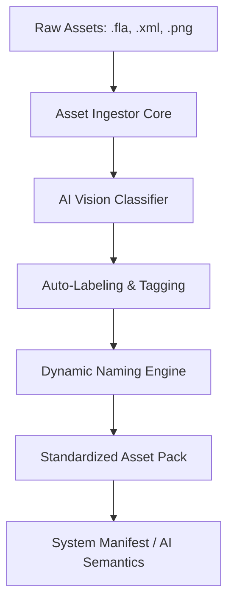

# Unified Asset Pipeline Architecture

This document outlines the architecture for the Unified Asset Pipeline, designed to process raw content from tools like Adobe Animate into standardized, AI-ready assets for Remotion video generation.

## 1. System Overview

The Unified Asset Pipeline automates the ingestion, classification, standardization, and delivery of project assets. It is essential for enabling the AI Director (Gemini) to perform Function Calling to locate and compose video scenes automatically.



## 2. Core Capabilities

### 2.1 Generic Ingestion

The pipeline handles multiple asset categories without hardcoded workflows. Supported types include:

- `expression`: Facial animations and emotions.
- `character_part`: Body components (arms, torso, head).
- `item`: Props and equippable objects.
- `background`: Scene environments.

### 2.2 Dynamic Naming Convention

All raw identifiers (e.g., Chinese characters, sequential numbers like `10000`) are stripped and replaced with deterministic, semantic IDs.

Format: `[asset_type]_[category_or_emotion]_[index]`

**Examples:**

- Expression: `exp_female_happy_01`
- Item: `item_sword_iron_01`
- Background: `bg_forest_day_01`
- Frames: `frame_0`, `frame_1` (for animated sprite sheets)

### 2.3 Contextual AI Vision Labeling

The pipeline utilizes AI Vision to categorize assets based on their type, generating rich metadata for subsequent search capabilities.

- **Expression Prompt:** Identifies the primary emotion (happy, sad, angry).
- **Item Prompt:** Identifies the item type (weapon, tool, food) and characteristics.
- **Background Prompt:** Identifies setting context (indoor, outdoor, time of day).

## 3. Data Architecture

### 3.1 Input Formats

- `.png`: Sprite sheets or isolated images.
- `.xml` or `.json`: Adobe Animate texture atlases.

### 3.2 Output Specification

The pipeline produces a standardized JSON manifest (`asset_manifest.json` or `ai_semantics.json`) that the Remotion engine and Gemini Function Calling can natively consume.

```json
{
  "asset_id": "exp_female_happy_01",
  "asset_type": "expression",
  "tags": ["female", "happy", "smile", "anime"],
  "image_path": "female_expression_sprite_sheet_001.png",
  "sprites": [
    {
      "name": "frame_0",
      "x": 0,
      "y": 0,
      "w": 143,
      "h": 102
    }
  ]
}
```

## 4. Execution Flow

1. **Ingest:** Script reads raw directory and parses XML/JSON coordinates.
2. **Classify:** Script isolates frames and sends keyframes to AI Vision API.
3. **Normalize:** Script rewrites names and generates semantic IDs.
4. **Compile:** Output is saved to `public/assets/[type]/[pack_name]/` alongside the original `.png`.
5. **Update Registry:** The central database is updated to expose the new assets for Function Calling.
