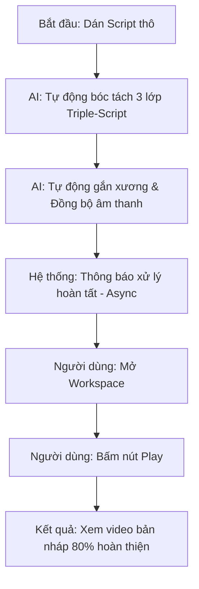
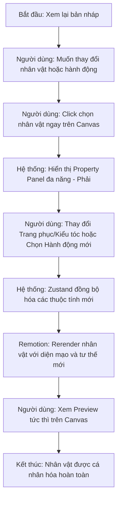

# UX Design Specification Auto_Video_Editor

**Author:** Nhan
**Date:** 2026-02-08

---

## Executive Summary

### Project Vision
Auto_Video_Editor là một "Virtual Studio" nơi người dùng đóng vai trò **Đạo diễn chiến lược**. Hệ thống xóa nhòa ranh giới giữa tự động hóa AI và sự chỉ đạo tinh tế của con người, giúp các Creator chuyên nghiệp tạo ra nội dung video 2D Animation có chiều sâu, giàu cảm xúc và đảm bảo tính độc bản để tối ưu hóa khả năng kiếm tiền.

### Target Users
*   **Minh (Professional Creator):** Nhà kể chuyện số, cần tốc độ sản xuất cao nhưng không chấp nhận "AI Slop". Minh đòi hỏi quyền kiểm soát các điểm chạm cảm xúc trong video.
*   **Sarah (Marketing Agency):** Người quản lý nhiều thương hiệu, cần sự nhất quán về phong cách (Consistent Vibes) và khả năng tái sử dụng tài nguyên (Project Cloning).

### Key Design Challenges
*   **Abstraction Balance:** Biến việc chỉnh sửa Metadata (Emotion Tags) phức tạp thành một trải nghiệm "Chỉ đạo" trực quan, dễ hiểu cho cả người không chuyên.
*   **Performance vs. Feedback:** Duy trì phản hồi UI tức thì (Instant Preview) trong khi xử lý các pipeline render media nặng nề (SVG Rigging, WebCodecs).
*   **Rigging Reliability:** Xử lý các tình huống AI Rigging không hoàn hảo thông qua các bước cân chỉnh UI trực quan, tránh gây ức chế cho người dùng.

### Design Opportunities
*   **One-Click Draft:** Chế độ tạo nhanh video 80% hoàn thiện từ script thô để tối ưu tốc độ cho Creator.
*   **Skeleton/Proxy Preview:** Sử dụng chế độ hiển thị khung xương/low-res để mang lại cảm giác mượt mà khi tinh chỉnh animation.
*   **Manual Calibration UI:** Cung cấp giao diện cân chỉnh điểm neo (Joints) nhanh chóng, biến rủi ro kỹ thuật thành một bước tùy chỉnh chuyên nghiệp.
*   **Virtual Host Closet:** Trải nghiệm lựa chọn và "thay đồ" cho nhân vật dẫn chuyện (Narrator) phù hợp với đa dạng chủ đề.

---

## Core User Experience

### Defining Experience
Trải nghiệm trọng tâm là **"Chỉ đạo bản nháp" (Directing the Draft)**. Thay vì thao tác kỹ thuật cắt ghép phức tạp, người dùng tập trung vào việc truyền tải cảm xúc và ý đồ thông qua việc điều chỉnh các "Thẻ Metadata" (Emotion Tags) trên một Timeline thông minh.

### Platform Strategy
*   **Web-Centric:** Tối ưu hóa cho các trình duyệt nhân Chromium trên Desktop để tận dụng tối đa sức mạnh của WebCodecs và WebGL.
*   **Precision Control:** Sử dụng Chuột và Bàn phím làm công cụ nhập liệu chính để đảm bảo độ chính xác khi điều khiển Timeline và cân chỉnh xương nhân vật.

### Effortless Interactions
*   **Auto-Decomposition:** Tự động bóc tách kịch bản thành các lớp Audio/Visual/Persona ngay khi người dùng nạp script.
*   **SVG Auto-Assembly & Rigging:** Tự động nhận diện và gán các điểm xoay (Pivot Points) cho các bộ phận nhân vật trong file SVG (Đầu, Thân, Chi...), giúp nhân vật sẵn sàng chuyển động ngay lập tức.
*   **Background Syncing:** Toàn bộ việc khớp miệng (Lip-sync) và chuyển cảnh được hệ thống tự động xử lý dựa trên kịch bản.

### Critical Success Moments
*   **"Bản nháp nhiệm màu":** Khoảnh khắc người dùng thấy nhân vật sống động thực hiện kịch bản chỉ sau một nút bấm.
*   **"Sửa lỗi trong chớp mắt":** Nhận ra việc thay đổi tông điệu video chỉ mất vài giây bằng cách kéo thả thẻ cảm xúc.

### Experience Principles
*   **Đạo diễn, không phải Thợ:** Mọi tương tác phải phục vụ tư duy sáng tạo của Đạo diễn.
*   **Phản hồi tức thì:** Ưu tiên tốc độ Preview để duy trì mạch cảm xúc của người thiết kế.
*   **Bản sắc là ưu tiên:** Khuyến khích sự khác biệt và cá nhân hóa trong từng sản phẩm đầu ra.

---

## Desired Emotional Response

### Primary Emotional Goals
*   **Empowered & Creative (Quyền năng & Sáng tạo):** Người dùng cảm thấy mình như một Đạo diễn thực thụ đang chỉ huy một đội ngũ AI chuyên nghiệp.
*   **Relief (Sự Nhẹ nhõm):** Cảm giác giải phóng khỏi các công việc kỹ thuật thủ công và tốn thời gian.
*   **Confidence (Sự Tự tin):** An tâm tuyệt đối về tính an toàn và khả năng kiếm tiền (Monetization Safety) của video.

### Emotional Journey Mapping
*   **Khám phá:** Sự Tò mò & Ngạc nhiên khi thấy hệ thống tự động Rigging và Animation.
*   **Sáng tác:** Trạng thái Tập trung cao độ (Flow) - ý tưởng được hiện thực hóa gần như ngay lập tức.
*   **Hoàn tất:** Sự Tự hào và Thỏa mãn khi sản phẩm đạt chất lượng studio với nỗ lực tối thiểu.
*   **Xử lý sự cố:** Cảm giác được Hỗ trợ và Tin tưởng vào hệ thống Failover.

### Micro-Emotions
*   **Delight (Sự Thú vị):** Phản ứng cử động nhỏ của nhân vật khi người dùng thay đổi Mood tag.
*   **Clarity (Sự Minh bạch):** Sự yên tâm khi luôn nắm bắt được trạng thái xử lý của hệ thống qua các chỉ báo trực quan.

### Design Implications
*   **Emotion-Design Connection:** Sử dụng các bộ điều khiển dạng thanh trượt (Sliders) và thẻ màu (Tags) để tạo cảm giác "Chỉ đạo" nghệ thuật thay vì nhập thông số kỹ thuật.
*   **Trust Building:** Hiển thị biểu tượng "Monetization Ready" và các báo cáo kiểm duyệt an toàn ngay trong Editor.

---

## UX Pattern Analysis & Inspiration

### Inspiring Products Analysis
*   **CapCut (Web):** Giao diện Timeline trực quan và các tính năng "Auto" giúp giảm rào cản gia nhập cho người dùng mới.
*   **HeyGen:** Quy trình cấu hình nhân vật (Persona) mượt mà và khả năng đồng bộ âm thanh-hình ảnh tạo hiệu ứng "Magic".
*   **Figma:** Cách tổ chức Layer và Sidebar thuộc tính (Properties) cực kỳ hiệu quả cho việc quản lý các đối tượng đồ họa phức tạp.

### Transferable UX Patterns
*   **Cấu trúc 3 cột:** Assets/Layers (Trái) - Preview/Canvas (Giữa) - Properties/Tags (Phải).
*   **"Magic Button":** Nút bấm trung tâm để kích hoạt AI tạo bản nháp tức thì.
*   **Dark Mode:** Tiêu chuẩn cho các công cụ sáng tạo để tối ưu hiển thị màu sắc của Media.

### Anti-Patterns to Avoid
*   **Quá tải Menu:** Tránh phong cách của Premiere Pro với quá nhiều cửa sổ con gây nhiễu cho người dùng mục tiêu (Director).
*   **Thông báo lỗi hệ thống:** Tuyệt đối không dùng mã lỗi kỹ thuật khô khan khi AI gặp sự cố Safety block; thay vào đó, hãy chỉ dẫn hành động cụ thể cho người dùng.

### Design Inspiration Strategy
*   **Figma for SVG:** Kế thừa cách quản lý thuộc tính layer của Figma để áp dụng cho việc cân chỉnh xương (Rigging) nhân vật SVG.
*   **Narrative Timeline:** Cải tiến Timeline truyền thống thành một dòng chảy câu chuyện, nơi người dùng điều khiển "Ý đồ" thay vì chỉ điều khiển "Thời gian".

---

## Design System Foundation

### Design System Choice
Sử dụng mô hình **Themeable System** với bộ công cụ **Shadcn UI + Tailwind CSS**.

### Rationale for Selection
1.  **Hệ sinh thái React:** Cả Shadcn UI và Remotion đều phát triển trên nền tảng React, đảm bảo sự tương thích tối đa và dễ dàng chia sẻ trạng thái (State) thông qua Zustand.
2.  **Tốc độ & Tùy biến:** Tận dụng được các thành phần UI chất lượng cao có sẵn nhưng vẫn có khả năng tùy chỉnh sâu để tạo bản sắc riêng (Unique Vibe) cho một công cụ sáng tạo.
3.  **Hỗ trợ Dark Mode:** Shadcn UI có cơ chế hỗ trợ Dark Mode cực tốt, phù hợp với tiêu chuẩn của các ứng dụng xử lý Media chuyên nghiệp.

### Implementation Approach
*   **State Management (Zustand):** Sử dụng Zustand làm "Cầu nối dữ liệu" giữa các thành phần UI (Shadcn) và Engine render video (Remotion). Toàn bộ các thay đổi về Emotion Tags hay Rigging Joints sẽ được đồng bộ qua Store chung này.
*   **Interactive Components:** Sử dụng **Framer Motion** kết hợp với Tailwind để tạo ra các hiệu ứng chuyển động mượt mà cho các thành phần điều khiển, tăng cảm giác "Delight" cho người dùng.

### Customization Strategy
*   **Visual Style:** Điều chỉnh hệ màu (Color Palette) hướng tới sự chuyên nghiệp với tông đen/xám chủ đạo, kết hợp với các màu nhấn (Accent colors) rực rỡ cho các thẻ Metadata để dễ phân biệt.
*   **Narrative Timeline UI:** Xây dựng component Timeline tùy chỉnh (Custom Component) dựa trên logic của Remotion nhưng có lớp vỏ bên ngoài đồng bộ với ngôn ngữ thiết kế của Shadcn UI.

---

## 2. Core User Experience

### 2.1 Defining Experience
Trải nghiệm quyết định của **Auto_Video_Editor** là **"Chỉ đạo Diễn xuất Toàn diện" (The Performance Director Flow)**. Thay vì chỉ gắn thẻ cảm xúc, người dùng thực hiện vai trò một Biên đạo, điều phối đa tầng các khía cạnh của nhân vật: Ngoại hình (Appearance), Hành động (Action), và Sự di chuyển (Movement).

### 2.2 User Mental Model
*   **Choreographer Model:** Người dùng không nghĩ về keyframe hay bone. Họ nghĩ: "Nhân vật này sẽ mặc đồ vest, đi bộ ra giữa sân khấu, vung tay chào khán giả và mỉm cười tự tin".
*   **AI as an Actor:** Người dùng coi AI là một diễn viên tài năng, chỉ cần nhận lệnh "Acting" là sẽ tự thực hiện các cử động khớp với kịch bản.

### 2.3 Success Criteria
*   **Instant Canvas Feedback:** Khi người dùng click vào nhân vật trên Preview Canvas, các thuộc tính về ngoại hình/tư thế phải hiển thị và cho phép thay đổi ngay lập tức.
*   **Tag Stacking Clarity:** Việc chồng lớp nhiều loại thẻ (Cảm xúc + Hành động + Di chuyển) trên cùng một mốc thời gian phải rõ ràng, không gây rối mắt.
*   **Smart Preset Suggestions:** Khi người dùng chọn một "Hành động", hệ thống tự động gợi ý các "Cảm xúc" và "Trang phục" phù hợp để giảm công sức chỉ đạo.

### 2.4 Novel UX Patterns
*   **Multi-track Behavior Bar:** Một loại Timeline mới chia thành các lớp chuyên biệt (Face, Body, Stage, Look) thay vì chỉ có Video/Audio tracks.
*   **Direct-on-Character Editing:** Click trực tiếp vào các bộ phận nhân vật (SVG layers) trong Preview để điều chỉnh vị trí hoặc thay đổi asset.

### 2.5 Experience Mechanics
1.  **Kích hoạt:** Click vào nhân vật hoặc bôi đen một đoạn kịch bản trên Timeline.
2.  **Tương tác:** Sử dụng "Behavior Palette" để chọn Cảm xúc/Hành động. Dùng kéo thả để xác định quỹ đạo di chuyển trên Canvas.
3.  **Phản hồi:** Preview hiển thị nhân vật ở dạng "Skeleton" di chuyển ngay lập tức theo chỉ dẫn. Các thẻ màu sắc tương ứng xuất hiện trên Behavior Bar.
4.  **Hoàn tất:** Bấm Play để xem Preview đầy đủ với âm thanh và visual style hoàn chỉnh.

---

## Visual Design Foundation

### Color System
*   **Chế độ:** Professional Dark Mode.
*   **Màu nền (Background):** `Slate-950` (#020617) - Tối ưu cho việc tập trung vào nội dung media.
*   **Màu chính (Primary):** `Indigo-500` (#6366f1) - Tạo cảm giác hiện đại và sáng tạo.
*   **Màu chức năng (Semantic):**
    *   *Success:* Green-500 (#22c55e) - "Monetization Safety" indicator.
    *   *Error/Alert:* Red-500 (#ef4444) - Safety block / In-line flagging.
    *   *Metadata Tags:* Một bảng màu rực rỡ (Amber, Rose, Cyan, Violet) để phân loại các hành vi nhân vật trên Timeline.

### Typography System
*   **Primary Font:** **Inter** - Dùng cho toàn bộ hệ thống UI, menu và thông báo để đảm bảo độ rõ nét trên màn hình kỹ thuật số.
*   **Secondary Font:** **JetBrains Mono** - Dùng cho các mã Metadata, nhãn của Tags và các thông số kỹ thuật để tạo phong cách "Technical Director".
*   **Type Scale:** Hệ thống phân cấp chữ rõ ràng (Heading 1-3, Body regular/small, Caption) giúp người dùng dễ dàng quét thông tin.

### Spacing & Layout Foundation
*   **Hệ thống Grid:** **8px Base Grid** mang lại sự nhất quán và nhịp điệu cho giao diện.
*   **Mật độ thông tin (Density):** Sử dụng thiết kế **Dense (Mật độ cao)** cho các khu vực Sidebar và Timeline để tối đa hóa không gian điều khiển cho người dùng chuyên nghiệp.
*   **Bố cục (Layout):** 3 cột (Sidebar trái: Assets/Library; Trung tâm: Preview Canvas & Timeline; Sidebar phải: Property Editor/Tags).

### Accessibility Considerations
*   **Contrast Ratio:** Đảm bảo độ tương phản giữa text và nền đạt tiêu chuẩn WCAG 2.1 AA (tối thiểu 4.5:1).
*   **Visual Cues:** Sử dụng cả Icon và Màu sắc cho các thẻ cảm xúc để hỗ trợ người dùng bị mù màu.
*   **Focus States:** Các trạng thái "Focus" rõ ràng khi người dùng thao tác bằng phím tắt hoặc tab menu.

---

## Design Direction Decision

### Design Directions Explored
Đã khám phá phong cách **"Performance Director"** tập trung vào tối ưu hóa luồng công việc cho Creator chuyên nghiệp. Thử nghiệm các phương án từ giao diện tối giản (Minimalist) đến giao diện mật độ cao (High-Density Dashboard).

### Chosen Direction
**"Professional Studio Dashboard"** - Một giao diện 3 cột vững chãi, sử dụng ngôn ngữ thiết kế Dark Mode hiện đại, tập trung vào Preview Canvas làm trung tâm và Timeline đa tầng làm công cụ điều khiển chính.

### Design Rationale
1.  **Phù hợp với Persona:** Minh (Creator) và Sarah (Agency) đã quen thuộc với các công cụ như CapCut và Figma. Việc kế thừa bố cục này giúp giảm thời gian làm quen (Learning curve).
2.  **Tôn vinh Nội dung:** Tông màu tối Slate-950 giúp màu sắc của các nhân vật 2D và video output trở nên nổi bật và trung thực nhất.
3.  **Khả năng điều phối:** Timeline đa tầng (Behavior Bar) là cách tốt nhất để thể hiện mô hình Triple-Script, cho phép người dùng kiểm soát đồng thời nhiều khía cạnh của nhân vật.

### Implementation Approach
Sử dụng **Shadcn UI** làm bộ khung (Shell), **Remotion** làm Canvas render, và **Zustand** để đồng bộ trạng thái giữa các bảng điều khiển (Properties) và nhân vật trong video.

---

## User Journey Flows

### 1. Luồng "Tạo bản nháp nhiệm màu" (The Magic Draft Flow)
Tối ưu hóa tốc độ từ Script thô sang video bản nháp 80% hoàn thiện.

### 2. Luồng "Chỉ đạo Diễn xuất Toàn diện" (The Performance Directing Flow)
Người dùng điều phối đa khía cạnh của nhân vật trong từng phân cảnh.

### 3. Journey Patterns
*   **Mẫu Phản hồi:** Sử dụng "Proxy/Skeleton view" (khung xương) để đảm bảo tốc độ phản hồi tức thì của UI ngay cả khi hệ thống đang render ngầm.
*   **Mẫu Điều khiển trực tiếp:** Click-to-edit trực tiếp trên Canvas nhân vật thay vì chỉ dùng menu chuột phải hoặc sidebar.

### 4. Flow Optimization Principles
*   **Context-Aware Properties:** Property Panel bên phải chỉ hiển thị các thuộc tính liên quan đến đối tượng đang được chọn (ví dụ: chọn nhân vật thì hiện kiểu tóc, chọn nền thì hiện hiệu ứng thời tiết).
*   **Batch Compatibility Check:** Trong luồng làm hàng loạt, hệ thống tự động kiểm tra tính tương thích giữa Script mới và Asset cũ để cảnh báo người dùng sớm nhất có thể.

---

## Component Strategy

### Design System Components
Tận dụng các thành phần chuẩn từ **Shadcn UI**:
*   **Layout:** Sidebar, Navigation Menu, Resizable Panels, Scroll Area.
*   **Controls:** Button, Slider, Select, Popover, Tooltip, Dropdown Menu.
*   **Feedback:** Progress Bar, Alert, Toast, Badge.

### Custom Components
Xây dựng 5 thành phần chuyên biệt cho Video Editor:
1.  **Narrative Timeline:** Timeline đa tầng (Face, Body, Stage) với Playhead chính xác đến từng Frame.
2.  **Behavior Tags:** Khối lệnh kéo thả chứa dữ liệu đa chiều (Mood + Action + Pos).
3.  **Remotion Canvas Wrapper:** Thành phần bao bọc Player của Remotion, tích hợp khả năng Click-to-Select Layers.
4.  **Skeleton Overlay:** Lớp phủ phản hồi thị giác dạng khung xương trong lúc xử lý Async.
5.  **SVG Joint Calibrator:** Giao diện cân chỉnh điểm neo thủ công cho các bộ phận SVG.

### Component Implementation Strategy
*   **Framework:** Xây dựng bằng React + Tailwind CSS.
*   **Animation:** Sử dụng **Framer Motion** cho các tương tác kéo thả và chuyển cảnh UI.
*   **State Bridge:** Sử dụng **Zustand** để duy trì "Single Source of Truth" cho cả UI controls và Video engine.

### Implementation Roadmap
*   **Phase 1 (Core):** Narrative Timeline, Canvas Wrapper, Basic Tags.
*   **Phase 2 (Support):** Property Panels, Style Presets, Skeleton View.
*   **Phase 3 (Advanced):** Joint Calibrator, Batch Compatibility Dashboard.

---

## UX Consistency Patterns

### Phân cấp Nút bấm (Button Hierarchy)
*   **Primary Action:** Indigo Solid (#6366f1). Dùng cho "Generate Draft", "Export", "Save".
*   **Secondary Action:** Indigo Outline/Ghost. Dùng cho "Clone Project", "Cancel".
*   **Destructive Action:** Red Solid (#ef4444). Dùng cho "Delete", "Reset All".

### Mẫu phản hồi (Feedback Patterns)
*   **Immediate Feedback:** Sử dụng Toasts cho các xác nhận thao tác nhanh (Copy/Paste tags).
*   **Async Status:** Thanh Progress Bar cố định ở cạnh trên cùng của Timeline track khi đang render.
*   **Validation:** In-line Highlighting (viền đỏ quanh text) cho các đoạn kịch bản vi phạm safety policy.

### Mẫu trạng thái trống (Empty States)
*   **New Project:** Hiển thị "Drop SVG here" area hoặc "Select Template" grid.
*   **No Narrative:** Hiển thị hướng dẫn gắn thẻ đầu tiên khi Timeline còn trống.

### Tương tác với Thẻ (Tag Interaction)
*   **Standard Interaction:** Click (Select) / Drag (Move) / Edge Drag (Resize Duration) / Double-click (Open Properties).
*   **Visual Standard:** Mỗi loại thẻ có một Icon đại diện và một dải màu riêng biệt (Face = Green, Body = Blue, Stage = Orange).

---

## Responsive Design & Accessibility

### Responsive Strategy
*   **Desktop (Full Studio):** Môi trường làm việc chính 3 cột, tối ưu cho chuột và bàn phím.
*   **Tablet (Review & Comment):** Giao diện đơn giản hóa, tập trung vào việc xem lại video và thay đổi nhanh các thuộc tính acting qua thanh trượt cảm ứng.
*   **Mobile (Monitor & Status):** Chế độ View-only, dùng để theo dõi tiến trình render và nhận thông báo hoàn tất.

### Breakpoint Strategy
*   **Mobile:** 320px - 767px (Hamburger menu, single column).
*   **Tablet:** 768px - 1023px (Collapsible sidebars, touch-friendly UI).
*   **Desktop:** 1024px+ (Full fixed sidebar layout).

### Accessibility Strategy
*   **Keyboard Focus:** Mọi hành động trên Timeline (Play, Tagging) đều có phím tắt (Keyboard shortcuts) cho power users.
*   **Contrast:** Tuân thủ chuẩn WCAG 2.1 AA cho toàn bộ bảng màu Dark Mode.
*   **Semantics:** Sử dụng đúng thẻ HTML và nhãn ARIA cho các trạng thái động của nhân vật AI.

### Testing & Implementation
*   Sử dụng đơn vị **rem** và **viewport units** để đảm bảo khả năng co giãn linh hoạt.
*   Kiểm thử đa thiết bị (BrowserStack/Real devices) để đảm bảo độ nhạy của các tương tác Timeline trên máy tính bảng.
