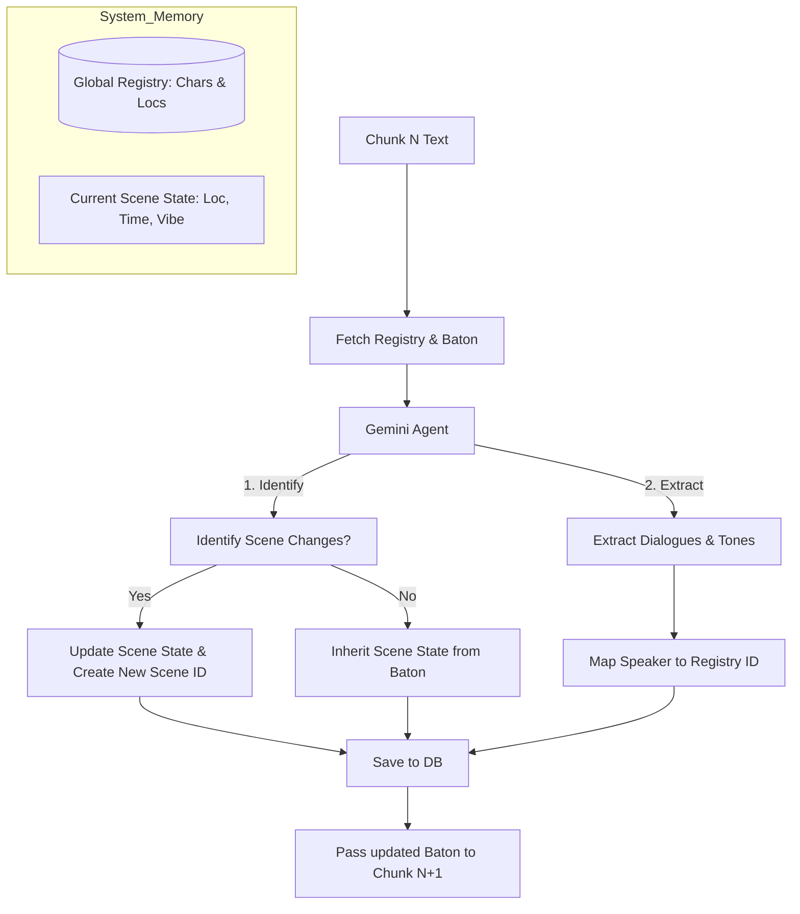

# Kiến trúc Tổng quát: Quản lý Trạng thái Ingestor (State Machine)

Tài liệu này không chỉ giải quyết các câu hỏi rời rạc mà mô tả một **Hệ thống Quản lý Trạng thái Tổng quát** giúp AI xử lý kịch bản dài vô tận (n chunks) mà vẫn đảm bảo tính nhất quán tuyệt đối.

## 1. Mô hình Phân lớp Dữ liệu (Layered Data Model)

Để AI không bị "loạn", hệ thống cần tách biệt hai loại "Trí nhớ":

| Lớp Dữ liệu | Tên gọi             | Phạm vi (Scope)   | Chức năng                                                                        |
| :---------- | :------------------ | :---------------- | :------------------------------------------------------------------------------- |
| **Lớp 1**   | **Global Registry** | Toàn bộ dự án     | Lưu danh bạ tất cả Nhân vật & Địa điểm từng xuất hiện (từ Chunk 1 đến hiện tại). |
| **Lớp 2**   | **Working Context** | Chunk N hiện hành | Lưu trạng thái "đang diễn ra" (Scene đang ở đâu, ai đang nói, tone chủ đạo).     |

---

## 2. Quy trình Xử lý cho Chunk N bất kỳ (The State Machine)

Hãy lấy ví dụ bạn đang ở **Chunk 100**. Làm sao để nó biết nó vẫn đang ở trong rừng?

### Bước A: Nạp "Gói Hành trang" (Context Injection)

Hệ thống không gửi text khơi khơi. Nó gửi kèm một đối tượng `State`:

- **Từ Global Registry:** "Đây là danh sách 15 nhân vật đã xuất hiện trong truyện, hãy dùng ID của họ."
- **Từ Chunk 99 (The Baton):** "Chunk 99 báo cáo vẫn đang ở Cảnh 5 (Khu rừng), thời gian Đêm. Trạng thái: Lan đang lo lắng."

### Bước B: AI Thực thi & Quyết định (Transition Logic)

AI đọc 300 từ của Chunk 100. Nó phải trả lời được câu hỏi: **Bối cảnh có thay đổi không?**

1.  **Nếu không đổi:** AI trích xuất lời thoại và gán thẳng vào `scene_id` hiện tại.
2.  **Nếu có biến chuyển (VD: Nhân vật bước vào nhà):** AI phải thực hiện 2 hành động:
    - Đóng (Finalize) cảnh cũ.
    - Tạo (Initialize) cảnh mới trong database và lấy `new_scene_id`.

### Bước C: Kết xuất & Chốt sổ (Output & Persistence)

AI trả về kết quả JSON kèm theo `End_State` của chính nó:

- _"Tôi đã xong Chunk 100. Trạng thái cuối cùng là: Đang ở trong Nhà, Lan đã bình tĩnh hơn. Mời Chunk 101 tiếp quản."_

---

## 3. Xử lý các Tình huống Phức tạp (Edge Cases)

### Tình huống 1: Nhân vật biến mất rồi xuất hiện lại (Chunk 1 -> Chunk 100)

- **Giải pháp:** Dùng **Global Registry**. Khi AI ở Chunk 100 thấy tên "Minh", nó tra cứu danh bạ toàn cục. Thấy ID_001 là Minh (đã tạo từ Chunk 1), nó dùng lại ID đó thay vì tạo mới.

### Tình huống 2: Nhiều bối cảnh đan xen (Flashback)

- **Giải pháp:** AI sử dụng Tool `search_scene(location="...")`. Nếu nó thấy kịch bản quay lại "Khu rừng" ngày xưa, nó sẽ tìm trong DB xem "Khu rừng" đó là `scene_id` nào để nối tiếp dữ liệu vào đó, thay vì coi là một khu rừng mới.

### Tình huống 3: Lỗi bóc tách ở Chunk N

- **Giải pháp:** **Cơ chế Self-Correction (Hệ thống miễn dịch)**.
  - Mỗi khi AI xuất JSON, một module Python nhỏ sẽ check: _"Speaker 'Lan' có nằm trong Global Registry không?"_.
  - Nếu không có -> Ném lỗi ngược lại cho AI: _"Bạn vừa tạo ra nhân vật Lan, nhưng trong danh bạ chỉ có Lân. Hãy kiểm tra xem có viết sai chính tả không?"_. AI tự sửa lại thành Lân.

## 4. Sơ đồ Hoạt động (Mermaid)

## 5. Tổng kết logic "Vàng"

Độ chính xác không đến từ việc AI thông minh, mà đến từ việc **bóp nghẹt sự tự do của AI**:

1. Ép AI dùng ID từ Database (Registry).
2. Ép AI báo cáo trạng thái cuối (Baton) cho thằng sau.
3. Luôn có một con AI thứ 2 (Reviewer) soi lỗi chính tả và logic của con AI thứ 1.

---

_Đây là kiến trúc chuẩn để xử lý các bộ phim dài tập hoặc tiểu thuyết nhiều chương._
