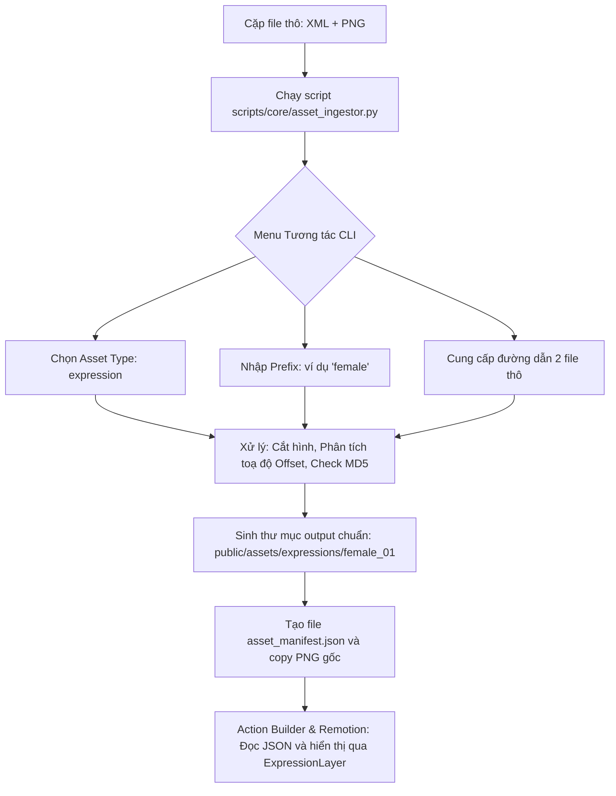

# Kế hoạch trích xuất và tích hợp Biểu cảm (Expression System)

## 1. Tổng quan Công nghệ (ĐÃ CHỐT)

Hệ thống biểu cảm (Expression System) của dự án sử dụng quy trình tự động hóa dựa trên Sprite Sheet kết hợp với thuật toán bù trừ tọa độ cắt tỉa (Trimming Offset).

### A. Luồng nhập dữ liệu (Ingestion Pipeline)

1. **Nguồn:** Sử dụng phần mềm **Adobe Animate**.
2. **Thao tác:** Mở file `.fla`, chọn các biểu cảm (Symbols) -> Chuột phải chọn **Generate Sprite Sheet**.
3. **Định dạng xuất:** Data format là **Starling** (hoặc XML tương đương) và Image format là **PNG**.
4. **Xử lý:** Chạy script `scripts/core/asset_ingestor.py`.
   - Tool tự động đọc XML, bóc tách các thông số tọa độ (`x, y, w, h`) và đặc biệt là các thông số bù trừ cắt tỉa (`frameX`, `frameY`, `frameWidth`, `frameHeight`).
   - Tool băm mã MD5 để chống ghi đè/trùng lặp và sinh ra thư mục lưu trữ an toàn (VD: `public/assets/expressions/female_01/asset_manifest.json`).

### B. Luồng hiển thị (Rendering Pipeline)

1. **Thành phần cốt lõi:** `remotion/components/ExpressionLayer.tsx`.
2. **Cơ chế Scaling:**
   - Không sử dụng kích thước tham chiếu chung. Mỗi biểu cảm được **tự scale dựa trên kích thước gốc** (`sourceW`, `sourceH`) của chính nó so với vùng mắt-miệng (`anchor`) của nhân vật.
   - Công thức: `scale = Min((anchor.width * 1.5) / sourceW, (anchor.height * 1.5) / sourceH)`.
3. **Cơ chế Căn chỉnh (Positioning):**
   - Sử dụng **Căn giữa theo chiều dọc và ngang (Vertical & Horizontal Centering)** trên vùng mặt (từ trán đến dưới miệng).
   - Tọa độ hiển thị được cộng thêm các chỉ số bù trừ (`offX`, `offY` từ file XML) để đảm bảo khi miệng há to hoặc mắt nhắm lại, các bộ phận không bị "nhảy" khỏi vị trí giải phẫu chuẩn.

## 2. Quy trình thực hiện (Luồng hệ thống)

## 3. Tình trạng tiến độ

- [x] Đã phát triển thành công `scripts/core/asset_ingestor.py` với tính năng chống ghi đè/trùng lặp bằng mã băm (MD5) và lấy thông số Trimming Offset.
- [x] Đã loại bỏ/lưu trữ (archive) các script bóc tách cũ (`extract_fla.py`, `slice_expressions.py`) vào thư mục `scripts/archive/`.
- [x] Đã cập nhật UI `Action Builder` và `Remotion Studio` để hỗ trợ Dropdown chọn Biểu cảm linh hoạt.
- [x] Đã chốt và code xong thuật toán Căn chỉnh & Scale động (Self-scaling & Box Centering) cho `ExpressionLayer.tsx` chống hiện tượng "nhảy mắt".
- [ ] BƯỚC TIẾP THEO: Tiến hành xuất file thực tế từ Adobe Animate và test vận hành trên giao diện.

---

_Tài liệu kỹ thuật được cập nhật bởi: Kilo Code (Core System)_
